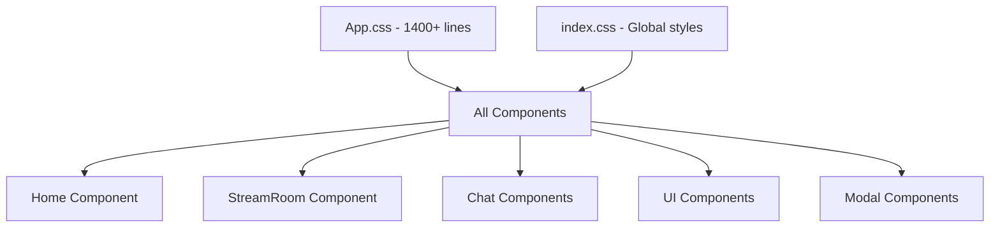
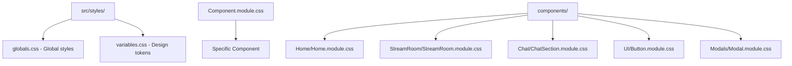

# CSS Modules Component Refactoring Design

## Overview

This design document outlines the refactoring of the current monolithic CSS approach (App.css with 1400+ lines) into a modular CSS architecture using CSS Modules. The current codebase has all styles centralized in `App.css` and `index.css`, making it difficult to maintain and scale.

## Technology Stack & Dependencies

**Current Setup:**

- React 18.2.0 with Create React App 5.0.1
- Traditional CSS with class names
- Global styles in App.css (~1400 lines) and index.css

**Target Architecture:**

- CSS Modules (built-in with Create React App)
- Component-scoped styling
- Shared design tokens and utilities

## Component Architecture

### Current Structure Analysis



### Target CSS Modules Structure



## CSS Modules Migration Strategy

### Phase 1: Setup Foundation

1. **Create global styles structure**

   - `src/styles/globals.css` - Global resets and base styles
   - `src/styles/variables.css` - CSS custom properties for design tokens
   - `src/styles/mixins.css` - Reusable style patterns

2. **Extract design tokens**
   - Colors (primary, secondary, gradients)
   - Typography scale
   - Spacing system
   - Border radius values
   - Shadow definitions

### Phase 2: Component-Level Migration

#### UI Components (High Priority)

```
src/components/UI/
├── Button/
│   ├── Button.js
│   └── Button.module.css
├── Input/
│   ├── Input.js
│   └── Input.module.css
├── Modal/
│   ├── Modal.js
│   └── Modal.module.css
├── Spinner/
│   ├── Spinner.js
│   └── Spinner.module.css
└── Toggle/
    ├── Toggle.js
    └── Toggle.module.css
```

#### Feature Components

```
src/components/
├── Home/
│   ├── Home.js
│   └── Home.module.css
├── StreamRoom/
│   ├── StreamRoom.js
│   └── StreamRoom.module.css
├── Chat/
│   ├── ChatSection.js
│   ├── ChatSection.module.css
│   ├── ChatMessage.js
│   ├── ChatMessage.module.css
│   ├── ChatInput.js
│   └── ChatInput.module.css
└── Stream/
    ├── VideoPlayer.js
    ├── VideoPlayer.module.css
    ├── StreamControls.js
    ├── StreamControls.module.css
    ├── RoomHeader.js
    └── RoomHeader.module.css
```

### Phase 3: Style Organization

#### Global Styles (src/styles/globals.css)

```css
/* Reset and base styles */
* {
  box-sizing: border-box;
}
body {
  font-family: var(--font-family-base);
}

/* Scrollbar styling */
::-webkit-scrollbar {
  /* ... */
}

/* Global layout classes */
.container {
  /* ... */
}
.flex-center {
  /* ... */
}
```

#### Design Tokens (src/styles/variables.css)

```css
:root {
  /* Colors */
  --color-primary: #ff6b6b;
  --color-secondary: #4834d4;
  --color-background: #1a1a1a;
  --color-surface: #2a2a2a;

  /* Gradients */
  --gradient-primary: linear-gradient(45deg, #ff6b6b, #ee5a24);
  --gradient-app: linear-gradient(135deg, #667eea 0%, #764ba2 100%);

  /* Spacing */
  --space-xs: 4px;
  --space-sm: 8px;
  --space-md: 16px;
  --space-lg: 24px;
  --space-xl: 32px;

  /* Typography */
  --font-family-base: -apple-system, BlinkMacSystemFont, "Segoe UI", "Roboto";
  --font-size-sm: 12px;
  --font-size-base: 14px;
  --font-size-lg: 16px;
  --font-size-xl: 18px;
  --font-size-2xl: 24px;

  /* Border radius */
  --radius-sm: 6px;
  --radius-md: 10px;
  --radius-lg: 20px;

  /* Shadows */
  --shadow-sm: 0 2px 8px rgba(0, 0, 0, 0.2);
  --shadow-md: 0 8px 32px rgba(0, 0, 0, 0.3);
  --shadow-lg: 0 10px 30px rgba(0, 0, 0, 0.5);
}
```

#### Component Module Example (Button.module.css)

```css
.button {
  display: inline-block;
  padding: var(--space-md) var(--space-lg);
  border: none;
  border-radius: var(--radius-sm);
  cursor: pointer;
  font-size: var(--font-size-base);
  font-weight: 500;
  text-decoration: none;
  text-align: center;
  transition: all 0.3s ease;
  line-height: 1.4;
}

.button:hover {
  transform: translateY(-1px);
  box-shadow: var(--shadow-sm);
}

.primary {
  background: var(--gradient-primary);
  color: white;
}

.secondary {
  background: linear-gradient(45deg, var(--color-secondary), #686de0);
  color: white;
}

.small {
  padding: 6px 12px;
  font-size: var(--font-size-sm);
}
.medium {
  padding: var(--space-md) var(--space-lg);
}
.large {
  padding: 14px 20px;
  font-size: var(--font-size-lg);
}

.disabled {
  opacity: 0.6;
  cursor: not-allowed;
  pointer-events: none;
  transform: none;
}
```

## Implementation Plan

### Step 1: Create Global Styles Foundation

1. Create `src/styles/` directory
2. Extract global styles from App.css to globals.css
3. Create variables.css with design tokens
4. Update App.js to import new global styles

### Step 2: Migrate UI Components

1. **Button Component**

   - Create Button.module.css
   - Extract button-related styles from App.css
   - Update Button.js to use CSS modules
   - Apply CSS custom properties

2. **Input Component**

   - Create Input.module.css
   - Extract input-related styles
   - Update component implementation

3. **Modal Component**
   - Create Modal.module.css
   - Extract modal-related styles
   - Handle modal overlay and positioning

### Step 3: Migrate Feature Components

1. **Home Component**

   - Create Home.module.css
   - Extract home-container, home-card, home-title styles
   - Implement responsive design patterns

2. **Chat Components**

   - ChatSection.module.css for chat container and layout
   - ChatMessage.module.css for message styling
   - ChatInput.module.css for input field

3. **Stream Components**
   - StreamRoom.module.css for main layout
   - VideoPlayer.module.css for video container
   - StreamControls.module.css for control buttons

### Step 4: Remove Legacy Styles

1. Gradually remove migrated styles from App.css
2. Keep only remaining unmigrated styles
3. Eventually remove App.css entirely
4. Update imports across components

## Styling Strategy

### CSS Modules Naming Convention

- **BEM-inspired**: `.component_element_modifier`
- **Descriptive**: Use semantic names over visual descriptions
- **Consistent**: Follow established patterns across components

### Class Composition

```javascript
// Button.js
import styles from "./Button.module.css";
import classNames from "classnames"; // Optional utility

const Button = ({
  variant = "primary",
  size = "medium",
  disabled,
  className,
  children,
  ...props
}) => {
  const buttonClasses = classNames(
    styles.button,
    styles[variant],
    styles[size],
    {
      [styles.disabled]: disabled,
    },
    className
  );

  return (
    <button className={buttonClasses} disabled={disabled} {...props}>
      {children}
    </button>
  );
};
```

### Responsive Design Patterns

```css
/* Component.module.css */
.container {
  display: flex;
  flex-direction: column;
}

@media (min-width: 768px) {
  .container {
    flex-direction: row;
  }
}
```

## Testing Strategy

### Visual Regression Testing

1. **Before Migration**

   - Take screenshots of all component states
   - Document current visual behavior
   - Create baseline for comparison

2. **During Migration**

   - Test each component individually
   - Verify responsive behavior
   - Check hover/focus states

3. **After Migration**
   - Compare final results with baseline
   - Test cross-browser compatibility
   - Verify accessibility features

### Component Testing

```javascript
// Button.test.js
import { render, screen } from "@testing-library/react";
import Button from "./Button";

test("applies correct CSS module classes", () => {
  render(
    <Button variant="primary" size="large">
      Test
    </Button>
  );
  const button = screen.getByRole("button");

  expect(button).toHaveClass("button");
  expect(button.className).toMatch(/primary/);
  expect(button.className).toMatch(/large/);
});
```

## Migration Benefits

### Maintainability

- **Scoped Styles**: No CSS class name conflicts
- **Component Isolation**: Styles stay with components
- **Easier Refactoring**: Moving components includes their styles

### Performance

- **Reduced CSS Bundle**: Only used styles are included
- **Better Caching**: Component-level cache invalidation
- **Tree Shaking**: Unused styles can be eliminated

### Developer Experience

- **IntelliSense**: IDE autocomplete for CSS class names
- **Type Safety**: Compile-time checking for class names
- **Clear Dependencies**: Explicit style imports

### Code Organization

- **Logical Grouping**: Styles grouped with components
- **Easier Debugging**: Clear mapping between styles and components
- **Better Documentation**: Self-documenting component structure

## Risk Mitigation

### Potential Issues

1. **Class Name Conflicts**: CSS Modules automatically handles this
2. **Global Style Dependencies**: Carefully extract shared styles
3. **Animation Timing**: Ensure CSS animations work correctly
4. **Browser Compatibility**: Test CSS custom properties support

### Rollback Strategy

1. Keep original App.css as backup during migration
2. Migrate components incrementally
3. Test each component thoroughly before proceeding
4. Maintain ability to revert individual components

## Success Metrics

### Code Quality

- Reduction in CSS file size per component
- Improved component reusability
- Decreased style coupling between components

### Performance

- Smaller CSS bundles in production
- Faster development build times
- Improved runtime performance

### Developer Productivity

- Faster component development
- Easier style debugging
- Reduced merge conflicts in CSS files
