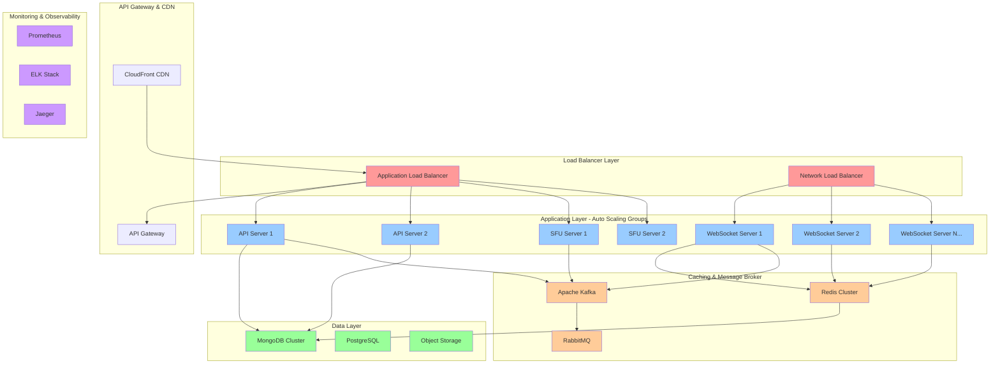
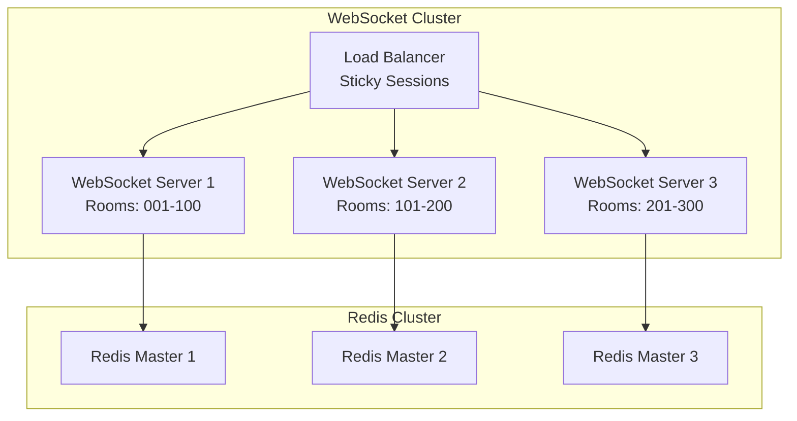
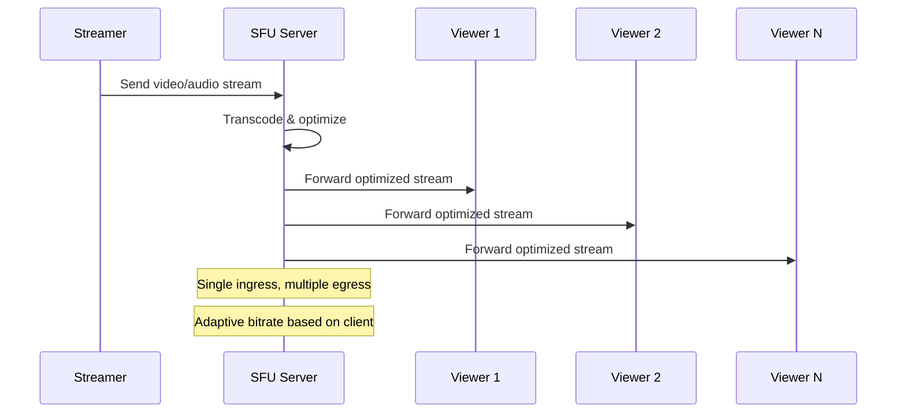
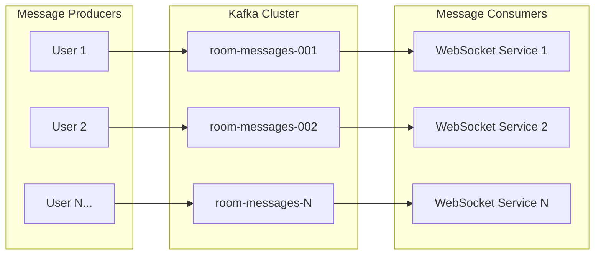
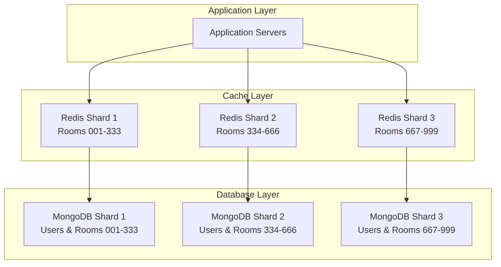
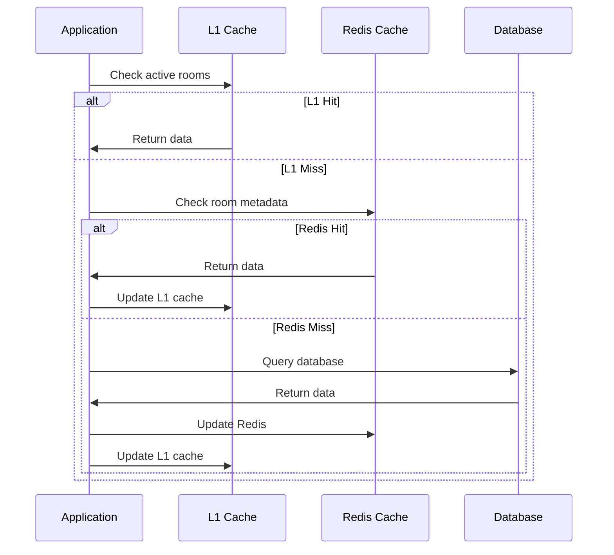
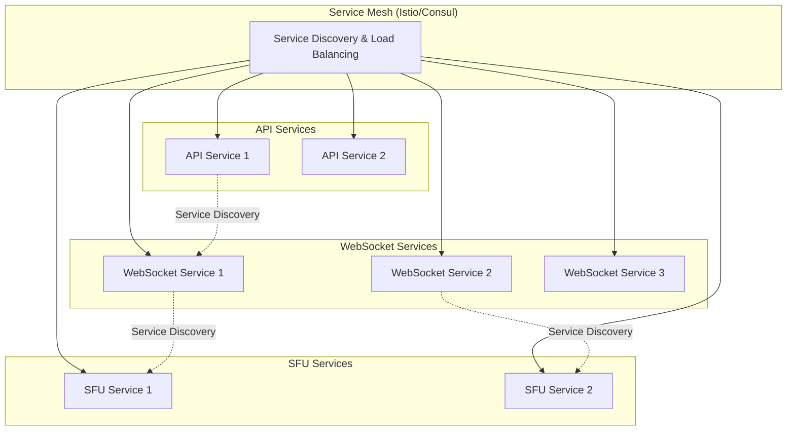
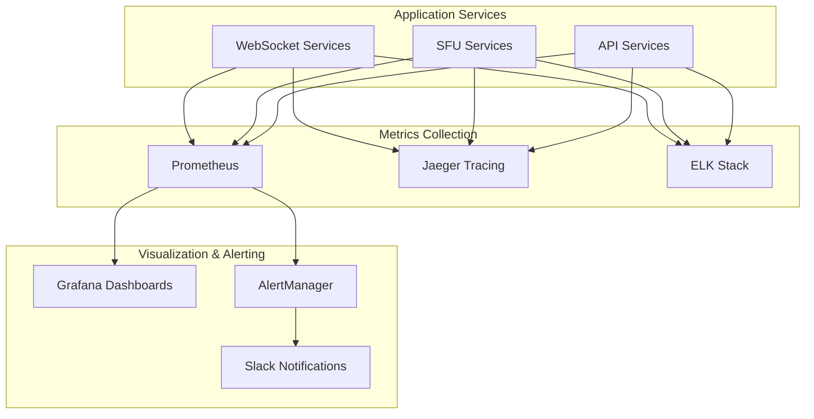
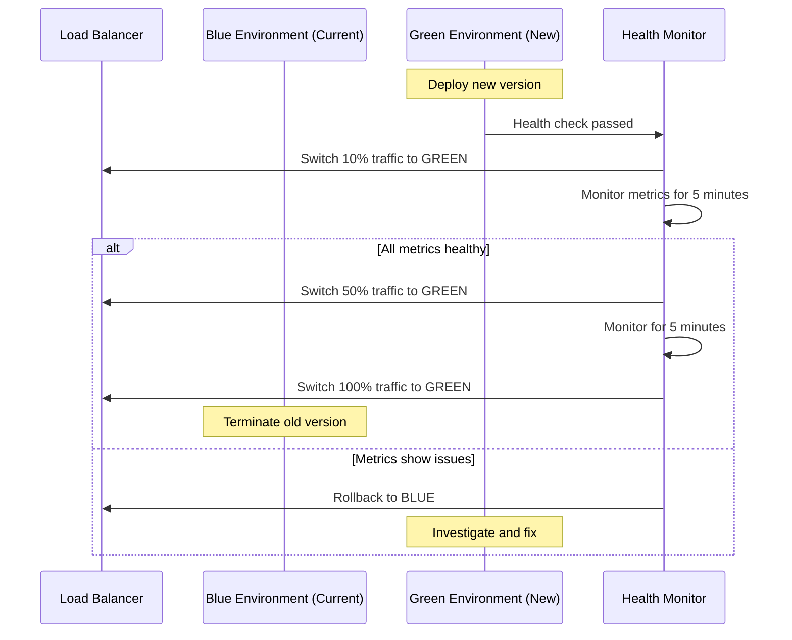

# High-Performance Scalable Live Streaming Server Architecture

## Overview

This document presents a comprehensive architecture design for transforming the current live streaming server from a single-instance, in-memory system to a high-performance, horizontally scalable infrastructure capable of handling 1000+ concurrent users in a single room without lag or performance degradation.

**Current System Limitations:**

- Single server instance bottleneck
- In-memory storage (data loss on restart)
- No load balancing or auto-scaling
- Limited WebRTC connection management
- No caching or optimization layers

**Target Performance Requirements:**

- Support 1000+ concurrent users per room
- Sub-100ms message delivery latency
- 99.9% uptime with horizontal scaling
- Zero-downtime deployments
- Auto-scaling based on load

## Architecture Overview

The new architecture implements a microservices-based approach with multiple specialized services working together to achieve high performance and scalability.



## Core Components

### 1. WebSocket Service Cluster

**Technology Stack:** Node.js + Socket.io + Sticky Sessions
**Scaling Strategy:** Horizontal Auto-scaling (2-20 instances)
**Load Distribution:** Consistent hashing by room ID



**Key Features:**

- Room-based sharding for optimal distribution
- Redis pub/sub for cross-server communication
- Connection pooling and keep-alive optimization
- Rate limiting per user (10 messages/second)
- Binary protocol optimization for WebRTC signaling

### 2. Selective Forwarding Unit (SFU) Service

**Technology Stack:** Node.js + mediasoup/Kurento
**Purpose:** Replace P2P WebRTC with centralized media routing
**Scaling:** Auto-scaling based on CPU/bandwidth usage



**Benefits:**

- Eliminates P2P connection limits (typically 10-20 connections)
- Server-side transcoding for adaptive bitrate
- Network optimization for viewers with poor connections
- Centralized quality control and monitoring

### 3. Real-time Messaging Service

**Technology Stack:** Apache Kafka + Redis
**Purpose:** Handle chat messages and real-time events
**Throughput:** 100,000+ messages/second

**Message Flow Architecture:**



### 4. Database Architecture

**Primary Database:** MongoDB (Horizontally Sharded)
**Cache Layer:** Redis Cluster
**Object Storage:** AWS S3/MinIO

**Data Distribution Strategy:**



## Performance Optimizations

### 1. Connection Management

**WebSocket Connection Pool:**

- Pre-allocated connection pools per server
- Connection recycling and health monitoring
- Automatic failover to backup servers

**Rate Limiting Strategy:**
| User Type | Messages/Second | Concurrent Connections |
|-----------|----------------|----------------------|
| Streamer | 50 | 1 per room |
| Premium Viewer | 10 | Unlimited |
| Free Viewer | 5 | 3 devices max |
| Anonymous | 2 | 1 device max |

### 2. Message Optimization

**Binary Protocol for WebRTC Signaling:**

```javascript
// Current JSON format (verbose)
{
  "type": "ice-candidate",
  "candidate": "candidate:1 1 UDP 2122260223 192.168.1.100 54400",
  "roomId": "room123",
  "userId": "user456"
}

// Optimized binary format (75% size reduction)
[TYPE_ICE_CANDIDATE, roomHash, userHash, candidateBuffer]
```

**Message Batching:**

- Batch non-critical messages (chat, user counts)
- Send batches every 100ms instead of immediate
- Prioritize WebRTC signaling messages

### 3. Caching Strategy

**Multi-level Caching:**

1. **L1 Cache (In-Memory):** Active room state (30-second TTL)
2. **L2 Cache (Redis):** User sessions, room metadata (5-minute TTL)
3. **L3 Cache (Database):** Persistent data with read replicas

**Cache Invalidation:**



## Horizontal Scaling Strategy

### 1. Auto-scaling Configuration

**Scaling Triggers:**

- CPU usage > 70% for 3 minutes → Scale up
- Memory usage > 80% → Scale up
- Active connections > 800 per server → Scale up
- CPU usage < 30% for 10 minutes → Scale down

**Scaling Limits:**

- Minimum instances: 2 (for redundancy)
- Maximum instances: 20 (cost optimization)
- Scale-up cooldown: 5 minutes
- Scale-down cooldown: 15 minutes

### 2. Load Distribution

**Room-based Sharding:**

```javascript
// Consistent hashing algorithm
function getServerForRoom(roomId) {
  const hash = murmurhash3(roomId);
  const serverIndex = hash % availableServers.length;
  return availableServers[serverIndex];
}

// Server affinity for room continuity
const roomServerMap = new Map();
function assignRoomToServer(roomId) {
  if (!roomServerMap.has(roomId)) {
    const server = getServerForRoom(roomId);
    roomServerMap.set(roomId, server);
  }
  return roomServerMap.get(roomId);
}
```

### 3. Service Mesh Architecture

**Inter-service Communication:**



## Implementation Phases

### Phase 1: Foundation (Weeks 1-2)

**Core Infrastructure Setup:**

1. **Docker Containerization**

   - Multi-stage Docker builds
   - Container orchestration with Docker Compose/Kubernetes
   - Health checks and readiness probes

2. **Database Migration**

   - MongoDB cluster setup with sharding
   - Redis cluster configuration
   - Data migration scripts from in-memory storage

3. **Basic Load Balancing**
   - NGINX reverse proxy configuration
   - Sticky session implementation
   - Health monitoring endpoints

### Phase 2: Messaging & WebRTC (Weeks 3-4)

**Real-time Communication Enhancement:**

1. **Kafka Integration**

   - Topic-based message routing
   - Consumer group configuration
   - Message ordering guarantees

2. **SFU Implementation**

   - mediasoup server setup
   - WebRTC offer/answer optimization
   - Adaptive bitrate streaming

3. **Binary Protocol**
   - WebRTC signaling optimization
   - Message compression
   - Protocol buffer implementation

### Phase 3: Optimization & Monitoring (Weeks 5-6)

**Performance & Observability:**

1. **Caching Implementation**

   - Multi-level cache setup
   - Cache warming strategies
   - TTL optimization

2. **Monitoring Stack**

   - Prometheus metrics collection
   - Grafana dashboards
   - ELK stack for log aggregation

3. **Performance Testing**
   - Load testing with 1000+ concurrent users
   - Latency optimization
   - Memory leak detection

## Monitoring & Observability

### 1. Key Performance Indicators (KPIs)

**Real-time Metrics:**
| Metric | Target | Alert Threshold |
|--------|--------|----------------|
| Message Latency | < 50ms | > 100ms |
| WebRTC Connection Success | > 95% | < 90% |
| Active Concurrent Users | - | > 800 per server |
| Memory Usage | < 80% | > 90% |
| CPU Usage | < 70% | > 85% |
| Error Rate | < 1% | > 2% |

### 2. Monitoring Architecture



### 3. Health Check Implementation

**Service Health Endpoints:**

```javascript
// WebSocket service health check
app.get("/health", (req, res) => {
  const health = {
    status: "healthy",
    timestamp: Date.now(),
    uptime: process.uptime(),
    memory: process.memoryUsage(),
    activeConnections: io.engine.clientsCount,
    activeRooms: rooms.size,
    redis: redisClient.status,
    version: process.env.VERSION || "1.0.0",
  };

  // Check Redis connectivity
  if (redisClient.status !== "ready") {
    health.status = "degraded";
    return res.status(503).json(health);
  }

  // Check memory usage
  if (health.memory.heapUsed / health.memory.heapTotal > 0.9) {
    health.status = "degraded";
    return res.status(503).json(health);
  }

  res.json(health);
});
```

## Deployment Strategy

### 1. Infrastructure as Code

**Terraform Configuration:**

```hcl
# Auto Scaling Group for WebSocket services
resource "aws_autoscaling_group" "websocket_servers" {
  name                = "websocket-servers"
  vpc_zone_identifier = var.private_subnets
  target_group_arns   = [aws_lb_target_group.websocket.arn]
  health_check_type   = "ELB"

  min_size         = 2
  max_size         = 20
  desired_capacity = 3

  launch_template {
    id      = aws_launch_template.websocket.id
    version = "$Latest"
  }

  tag {
    key                 = "Name"
    value               = "websocket-server"
    propagate_at_launch = true
  }
}

# Auto Scaling Policies
resource "aws_autoscaling_policy" "scale_up" {
  name                   = "scale-up"
  scaling_adjustment     = 2
  adjustment_type        = "ChangeInCapacity"
  cooldown               = 300
  autoscaling_group_name = aws_autoscaling_group.websocket_servers.name
}
```

### 2. Blue-Green Deployment

**Zero-downtime Deployment Strategy:**



### 3. Configuration Management

**Environment-specific Configurations:**

```yaml
# config/production.yaml
server:
  port: 3000
  cluster_mode: true
  workers: ${CPU_CORES}

redis:
  cluster_endpoints:
    - redis-cluster-1.cache.amazonaws.com:6379
    - redis-cluster-2.cache.amazonaws.com:6379
    - redis-cluster-3.cache.amazonaws.com:6379

scaling:
  min_instances: 2
  max_instances: 20
  target_cpu_utilization: 70
  target_memory_utilization: 80

rate_limiting:
  streamer_messages_per_second: 50
  viewer_messages_per_second: 10
  anonymous_messages_per_second: 2

websocket:
  max_connections_per_server: 1000
  ping_interval: 25000
  ping_timeout: 5000

webrtc:
  ice_servers:
    - urls: "stun:stun.l.google.com:19302"
    - urls: "turn:turn.example.com:3478"
      username: "user"
      credential: "pass"
```

## Testing Strategy

### 1. Load Testing

**JMeter/Artillery Test Scenarios:**

```javascript
// artillery-config.yaml
config:
  target: 'wss://api.example.com'
  phases:
    - duration: 300  # 5 minutes ramp-up
      arrivalRate: 10
      rampTo: 100
    - duration: 600  # 10 minutes sustained load
      arrivalRate: 100
    - duration: 300  # 5 minutes peak load
      arrivalRate: 200

scenarios:
  - name: "Join room and send messages"
    engine: ws
    weight: 80
    flow:
      - connect:
          url: "/"
      - emit:
          channel: "join-room"
          data:
            roomId: "{{ $randomString() }}"
            username: "user-{{ $uuid }}"
            isStreamer: false
      - loop:
          - emit:
              channel: "chat-message"
              data:
                message: "Hello from {{ $uuid }}"
                roomId: "{{ roomId }}"
          - think: 5
        count: 20
```

### 2. Chaos Engineering

**Resilience Testing:**

```bash
# Chaos Monkey scenarios
# 1. Random server termination
kubectl delete pod -l app=websocket-server --random

# 2. Network latency injection
tc qdisc add dev eth0 root netem delay 200ms 50ms

# 3. Memory pressure simulation
stress --vm 1 --vm-bytes 1G --timeout 300s

# 4. Redis cluster node failure
kubectl scale deployment redis-cluster --replicas=2
```

This architecture provides a robust, scalable foundation capable of handling 1000+ concurrent users per room while maintaining low latency and high availability. The implementation follows cloud-native best practices and provides comprehensive monitoring and observability for production operations.
