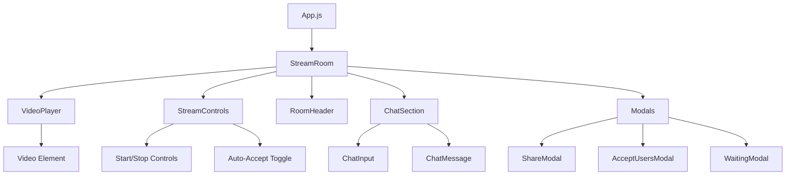
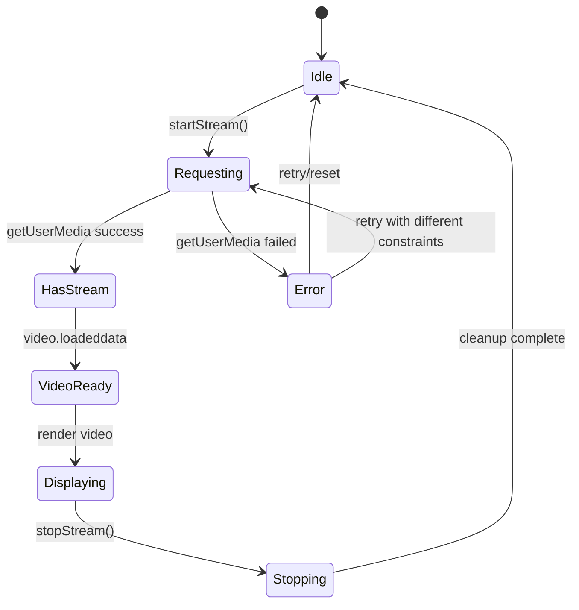
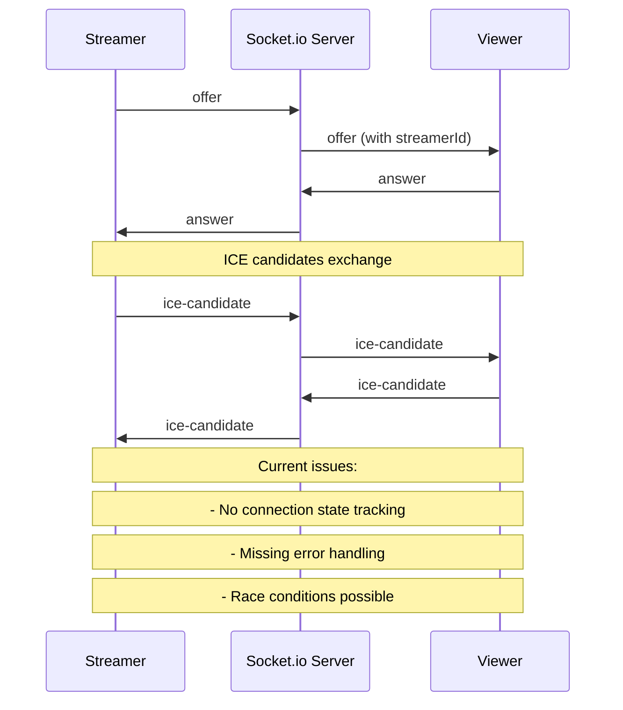
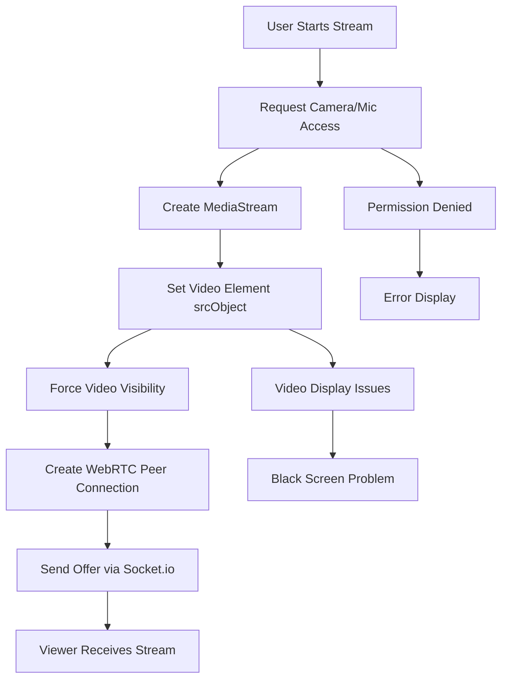
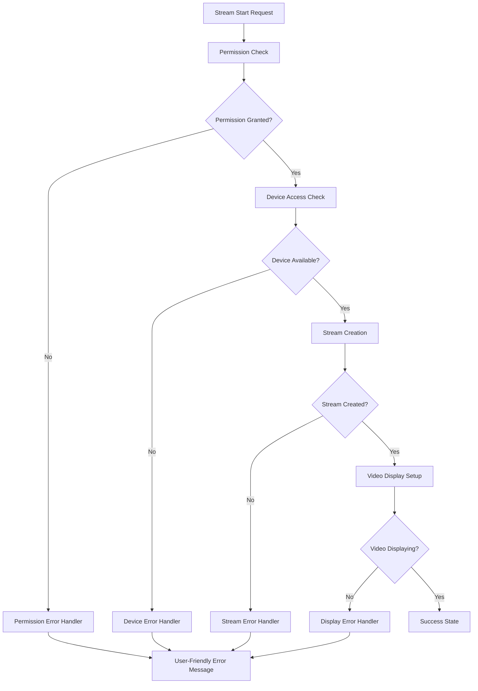
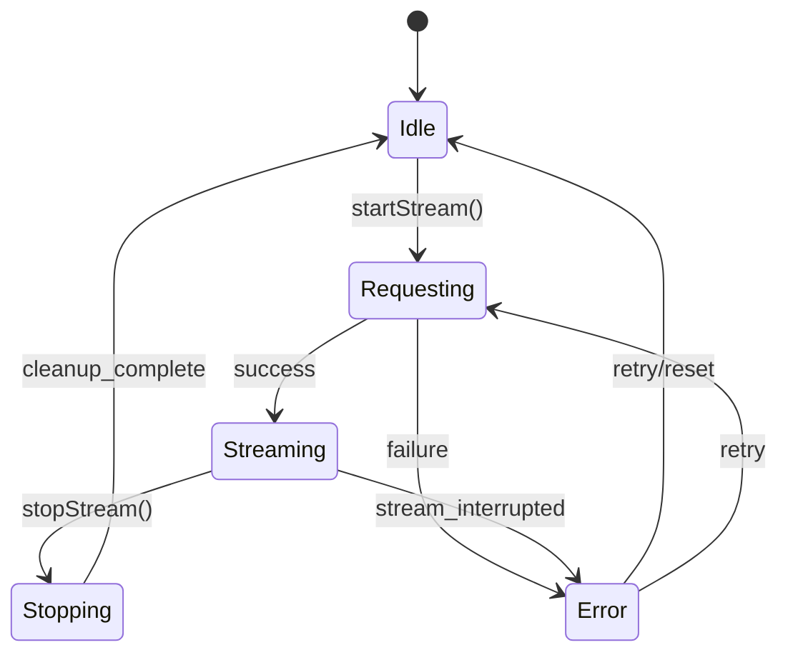

# Stream Error Repair Design Document

## Overview

This document provides a comprehensive design for fixing streaming errors in the web livestream application. The current implementation has several critical issues that prevent proper video streaming functionality, including video display problems, WebRTC configuration issues, media constraints conflicts, and error handling gaps.

## Repository Type Analysis

**Repository Classification: Full-Stack Application**

This is a comprehensive full-stack web application with the following characteristics:

**Frontend Architecture:**

- React.js 18 application with sophisticated component structure
- 7 main component categories (Chat, Home, Modals, QuickJoin, Stream, StreamRoom, UI)
- Custom hooks for complex logic (useSocket, useWebRTC, useStreamRoom)
- Advanced WebRTC implementation with peer-to-peer streaming
- Real-time state management and Socket.io integration

**Backend Architecture:**

- Node.js/Express server with Socket.io for real-time communication
- WebRTC signaling server handling offers, answers, and ICE candidates
- Room management system with user permissions
- In-memory data storage for rooms and users
- RESTful API endpoints for room information

**Complexity Assessment:**

- **High Complexity**: Not a simple project
- Advanced real-time features (live streaming, chat, WebRTC)
- Multiple interconnected systems (video streaming, chat, room management)
- Complex state management across client-server architecture
- Professional component organization and modular design

**Key Technical Features:**

- WebRTC peer-to-peer video streaming
- Real-time bidirectional communication via Socket.io
- Dynamic room creation and management
- User permission system (streamers vs viewers)
- Advanced error handling and loading states
- Responsive UI with multiple interactive modals

This application requires a comprehensive full-stack documentation approach covering both frontend component architecture and backend service design.

## Technology Stack Assessment

**Current Stack:**

- Frontend: React.js 18 with WebRTC API
- Backend: Node.js with Express and Socket.io
- Real-time Communication: Socket.io for signaling, WebRTC for media streaming
- Styling: CSS3 with forced visibility styles

## Frontend Architecture

### Component Architecture Analysis

#### Current Component Hierarchy



#### Component State Management Issues

**Problem: Video Display State Conflicts**

- VideoPlayer component has conflicting visibility logic
- Manual DOM manipulation fighting with React state
- CSS classes applied inconsistently

**Current VideoPlayer Logic Issues:**

```javascript
// PROBLEMATIC CURRENT LOGIC
const shouldShowVideo = () => {
  if (isStreamer) {
    return isStreaming && hasSrcObject; // Sometimes false when should be true
  }
  return hasSrcObject && isVideoReady; // readyState check too strict
};
```

**Solution: Simplified State-Driven Visibility**

```javascript
// IMPROVED LOGIC
const shouldShowVideo = () => {
  // Show video if there's a valid stream source
  return !!videoRef?.current?.srcObject;
};

const getVideoClassName = () => {
  const baseClass = "video-element";
  const visibilityClass = shouldShowVideo() ? "video-visible" : "video-hidden";
  return `${baseClass} ${visibilityClass}`;
};
```

#### Hooks Architecture Improvements

**useWebRTC Hook Enhancement**

Current Issues:

- Inconsistent media constraints
- Poor error handling
- Manual video element manipulation

Fixed Implementation:

```javascript
const useWebRTC = (socket, roomId) => {
  const [streamState, setStreamState] = useState({
    status: "idle", // idle, requesting, streaming, error, stopping
    error: null,
    mediaStream: null,
  });

  const [videoConstraints] = useState({
    video: {
      width: { ideal: 640, min: 320, max: 1280 },
      height: { ideal: 480, min: 240, max: 720 },
      frameRate: { ideal: 15, min: 10, max: 30 },
      facingMode: "user",
    },
    audio: {
      echoCancellation: true,
      noiseSuppression: true,
      autoGainControl: true,
    },
  });

  const startStream = useCallback(
    async (videoRef) => {
      try {
        setStreamState((prev) => ({
          ...prev,
          status: "requesting",
          error: null,
        }));

        const mediaStream = await navigator.mediaDevices.getUserMedia(
          videoConstraints
        );

        if (videoRef?.current) {
          videoRef.current.srcObject = mediaStream;
          // Let React handle visibility through state
        }

        setStreamState({
          status: "streaming",
          error: null,
          mediaStream,
        });

        await createPeerConnection(mediaStream);
        return mediaStream;
      } catch (error) {
        const errorInfo = handleStreamError(error);
        setStreamState({
          status: "error",
          error: errorInfo,
          mediaStream: null,
        });
        throw error;
      }
    },
    [videoConstraints, createPeerConnection]
  );

  return {
    streamState,
    startStream,
    stopStream,
    // ... other methods
  };
};
```

### State Management Strategy

#### Video Display State Machine



#### Stream Error Types and Handling

```javascript
const StreamErrorTypes = {
  PERMISSION_DENIED: "NotAllowedError",
  DEVICE_NOT_FOUND: "NotFoundError",
  DEVICE_BUSY: "NotReadableError",
  OVERCONSTRAINED: "OverconstrainedError",
  UNKNOWN: "UnknownError",
};

const handleStreamError = (error) => {
  const errorMap = {
    [StreamErrorTypes.PERMISSION_DENIED]: {
      message:
        "Camera/microphone access denied. Please allow permissions and try again.",
      recoverable: true,
      action: "request_permission",
    },
    [StreamErrorTypes.DEVICE_NOT_FOUND]: {
      message: "No camera or microphone found. Please connect a device.",
      recoverable: false,
      action: "check_devices",
    },
    [StreamErrorTypes.DEVICE_BUSY]: {
      message: "Camera/microphone is being used by another application.",
      recoverable: true,
      action: "close_other_apps",
    },
    [StreamErrorTypes.OVERCONSTRAINED]: {
      message: "Camera settings not supported. Trying with lower quality.",
      recoverable: true,
      action: "fallback_constraints",
    },
  };

  return (
    errorMap[error.name] || {
      message: `Stream error: ${error.message}`,
      recoverable: true,
      action: "retry",
    }
  );
};
```

#### CSS Styling Improvements

**Problem: Conflicting CSS Rules**
Current CSS has multiple conflicting rules causing display issues:

```css
/* PROBLEMATIC CURRENT STYLES */
.video-element {
  display: block !important; /* Conflicts with hidden class */
  visibility: visible !important;
  opacity: 1 !important;
}

.video-element.hidden {
  display: none !important; /* Fights with above */
  visibility: hidden !important;
  opacity: 0 !important;
}
```

**Fixed CSS Implementation:**
```css
/* CLEAN, NON-CONFLICTING STYLES */
.video-element {
  width: 100%;
  height: 100%;
  object-fit: cover;
  position: absolute;
  top: 0;
  left: 0;
  transition: opacity 0.3s ease;
}

.video-visible {
  opacity: 1;
  visibility: visible;
  z-index: 1;
}

.video-hidden {
  opacity: 0;
  visibility: hidden;
  z-index: -1;
}

/* Remove all !important declarations */
```

## Backend Architecture

### WebRTC Signaling Server Enhancement

#### Current Signaling Flow Issues


#### Enhanced Signaling Implementation

**Connection State Tracking:**
```javascript
// Enhanced server connection management
const connectionStates = new Map(); // socketId -> connectionInfo

const updateConnectionState = (socketId, state) => {
  const current = connectionStates.get(socketId) || {};
  connectionStates.set(socketId, {
    ...current,
    ...state,
    lastUpdate: Date.now()
  });
};

// Enhanced offer handling
socket.on("offer", ({ offer, roomId }) => {
  console.log("🔵 SERVER: Received offer from", socket.id);
  
  updateConnectionState(socket.id, {
    role: 'streamer',
    roomId,
    offerSent: true,
    status: 'offering'
  });
  
  socket.to(roomId).emit("offer", { 
    offer, 
    streamerId: socket.id,
    timestamp: Date.now()
  });
// Enhanced answer handling
socket.on("answer", ({ answer, streamerId }) => {
  console.log("🔵 SERVER: Received answer from", socket.id, "to", streamerId);
  
  updateConnectionState(socket.id, {
    role: 'viewer',
    streamerId,
    answerSent: true,
    status: 'answering'
  });
  
  updateConnectionState(streamerId, {
    status: 'connected',
    connectedViewers: (connectionStates.get(streamerId)?.connectedViewers || 0) + 1
  });
  
  socket.to(streamerId).emit("answer", { 
    answer, 
    viewerId: socket.id,
    timestamp: Date.now()
  });
});

// Connection health monitoring
socket.on("connection-health", ({ status, streamerId }) => {
  console.log("🔵 SERVER: Connection health update", status);
  
  if (status === 'failed' || status === 'disconnected') {
    // Handle connection failure
    handleConnectionFailure(socket.id, streamerId);
  }
});

const handleConnectionFailure = (viewerId, streamerId) => {
  // Notify both parties
  socket.to(viewerId).emit("connection-failed", { streamerId });
  socket.to(streamerId).emit("viewer-disconnected", { viewerId });
  
  // Update connection states
  updateConnectionState(viewerId, { status: 'failed' });
  const streamerState = connectionStates.get(streamerId);
  if (streamerState) {
    updateConnectionState(streamerId, {
      connectedViewers: Math.max(0, (streamerState.connectedViewers || 1) - 1)
    });
  }
};
```

#### Room Management Enhancement

**Enhanced Room Management:**
```javascript
const enhancedRooms = new Map(); // roomId -> roomInfo

const createRoom = (roomId, streamerId, username) => {
  const room = {
    id: roomId,
    streamer: { 
      id: streamerId, 
      username,
      connectionState: 'active',
      startTime: Date.now()
    },
    viewers: new Map(),
    messages: [],
    autoAccept: true,
    streamStats: {
      totalViewers: 0,
      currentViewers: 0,
      averageViewTime: 0
    },
    connectionHealth: {
      lastPing: Date.now(),
      consecutiveFailures: 0,
      status: 'healthy'
    }
  };
  
  enhancedRooms.set(roomId, room);
  return room;
};
```

### Error Recovery Mechanisms

#### Automatic Reconnection Logic
```javascript
// Client-side reconnection handling
socket.on('streamer-disconnected', ({ roomId }) => {
  console.log('🟡 CLIENT: Streamer disconnected, attempting reconnection...');
  
  let reconnectAttempts = 0;
  const maxReconnectAttempts = 5;
  const reconnectInterval = 2000;
  
  const attemptReconnection = () => {
    if (reconnectAttempts >= maxReconnectAttempts) {
      setStreamError('Streamer disconnected. Please try joining again later.');
      return;
    }
    
    reconnectAttempts++;
    socket.emit('rejoin-room', { roomId });
    
    setTimeout(() => {
      if (!isConnected) {
        attemptReconnection();
      }
    }, reconnectInterval * reconnectAttempts);
  };
  
  attemptReconnection();
});
```

## Testing Strategy

### Unit Testing Focus Areas

#### Stream Management Testing
```javascript
// Test cases for useWebRTC hook
describe('useWebRTC Hook', () => {
  test('should handle getUserMedia success', async () => {
    const mockStream = { getTracks: () => [] };
    navigator.mediaDevices.getUserMedia = jest.fn().resolves(mockStream);
    
    const { result } = renderHook(() => useWebRTC(mockSocket, 'room123'));
    
    await act(async () => {
      await result.current.startStream(mockVideoRef);
    });
    
    expect(result.current.streamState.status).toBe('streaming');
    expect(result.current.streamState.mediaStream).toBe(mockStream);
  });
  
  test('should handle permission denied error', async () => {
    const permissionError = new Error('Permission denied');
    permissionError.name = 'NotAllowedError';
    navigator.mediaDevices.getUserMedia = jest.fn().rejects(permissionError);
    
    const { result } = renderHook(() => useWebRTC(mockSocket, 'room123'));
    
    await act(async () => {
      try {
        await result.current.startStream(mockVideoRef);
      } catch (error) {
        expect(error.name).toBe('NotAllowedError');
      }
    });
    
    expect(result.current.streamState.status).toBe('error');
    expect(result.current.streamState.error.action).toBe('request_permission');
  });
});
```

#### Video Display Testing
```javascript
describe('VideoPlayer Component', () => {
  test('should show video when stream is available', () => {
    const mockVideoRef = {
      current: {
        srcObject: { getTracks: () => [{}] }
      }
    };
    
    render(
      <VideoPlayer 
        videoRef={mockVideoRef}
        isStreamer={true}
        isStreaming={true}
      />
    );
    
    const videoElement = screen.getByRole('video');
    expect(videoElement).toHaveClass('video-visible');
    expect(videoElement).not.toHaveClass('video-hidden');
  });
  
  test('should show placeholder when no stream', () => {
    const mockVideoRef = { current: { srcObject: null } };
    
    render(
      <VideoPlayer 
        videoRef={mockVideoRef}
        isStreamer={true}
        isStreaming={false}
      />
    );
    
    expect(screen.getByText(/Nhấn "Bắt đầu Stream"/)).toBeInTheDocument();
  });
});
```

### Integration Testing

#### End-to-End Stream Testing
```javascript
describe('Complete Streaming Flow', () => {
  test('streamer can start stream and viewer can connect', async () => {
    // Setup streamer
    const streamerSocket = io('http://localhost:5000');
    const viewerSocket = io('http://localhost:5000');
    
    // Streamer joins room
    streamerSocket.emit('join-room', {
      roomId: 'test123',
      username: 'streamer',
      isStreamer: true
    });
    
    // Wait for room creation
    await new Promise(resolve => {
      streamerSocket.on('streamer-status', (data) => {
        expect(data.isStreamer).toBe(true);
        resolve();
      });
    });
    
    // Viewer joins room
    viewerSocket.emit('join-room', {
      roomId: 'test123',
      username: 'viewer',
      isStreamer: false
    });
    
    // Test WebRTC signaling
    const mockOffer = { type: 'offer', sdp: 'mock-sdp' };
    streamerSocket.emit('offer', { offer: mockOffer, roomId: 'test123' });
    
    await new Promise(resolve => {
      viewerSocket.on('offer', ({ offer, streamerId }) => {
        expect(offer).toEqual(mockOffer);
        expect(streamerId).toBe(streamerSocket.id);
        resolve();
      });
    });
  });
});
```

## Performance Optimizations

### Video Quality Management

#### Adaptive Quality Implementation
```javascript
const useAdaptiveQuality = (peerConnection) => {
  const [currentQuality, setCurrentQuality] = useState('medium');
  const [networkStats, setNetworkStats] = useState({});
  
  const qualityProfiles = {
    low: {
      video: { width: 320, height: 240, frameRate: 15 },
      audio: { sampleRate: 22050 }
    },
    medium: {
      video: { width: 640, height: 480, frameRate: 20 },
      audio: { sampleRate: 44100 }
    },
    high: {
      video: { width: 1280, height: 720, frameRate: 30 },
      audio: { sampleRate: 48000 }
    }
  };
  
  const monitorConnection = useCallback(() => {
    if (!peerConnection) return;
    
    peerConnection.getStats().then(stats => {
      stats.forEach(report => {
        if (report.type === 'inbound-rtp') {
          const packetsLost = report.packetsLost || 0;
          const packetsReceived = report.packetsReceived || 0;
          const lossRate = packetsLost / (packetsLost + packetsReceived);
          
          setNetworkStats(prev => ({ ...prev, lossRate }));
          
          // Adjust quality based on loss rate
          if (lossRate > 0.05 && currentQuality !== 'low') {
            setCurrentQuality('low');
          } else if (lossRate < 0.01 && currentQuality !== 'high') {
            setCurrentQuality('high');
          }
        }
      });
    });
  }, [peerConnection, currentQuality]);
  
  useEffect(() => {
    const interval = setInterval(monitorConnection, 5000);
    return () => clearInterval(interval);
  }, [monitorConnection]);
  
  return { currentQuality, qualityProfiles, networkStats };
};
```

### Resource Management

#### Memory Leak Prevention
```javascript
const useResourceCleanup = () => {
  const resourcesRef = useRef({
    mediaStreams: new Set(),
    peerConnections: new Set(),
    eventListeners: new Map()
  });
  
  const addResource = useCallback((type, resource) => {
    resourcesRef.current[type].add(resource);
  }, []);
  
  const cleanupAll = useCallback(() => {
    // Cleanup media streams
    resourcesRef.current.mediaStreams.forEach(stream => {
      stream.getTracks().forEach(track => track.stop());
    });
    
    // Cleanup peer connections
    resourcesRef.current.peerConnections.forEach(pc => {
      pc.close();
    });
    
    // Remove event listeners
    resourcesRef.current.eventListeners.forEach((cleanup, element) => {
      cleanup();
    });
    
    // Clear sets
    resourcesRef.current.mediaStreams.clear();
    resourcesRef.current.peerConnections.clear();
    resourcesRef.current.eventListeners.clear();
  }, []);
  
  useEffect(() => {
    return cleanupAll; // Cleanup on unmount
  }, [cleanupAll]);
  
  return { addResource, cleanupAll };
};
```

```css
/* CLEAN, NON-CONFLICTING STYLES */
.video-element {
  width: 100%;
  height: 100%;
  object-fit: cover;
  position: absolute;
  top: 0;
  left: 0;
  transition: opacity 0.3s ease;
}

.video-visible {
  opacity: 1;
  visibility: visible;
  z-index: 1;
}

.video-hidden {
  opacity: 0;
  visibility: hidden;
  z-index: -1;
}

/* Remove all !important declarations */
```

### Current System Flow



### Identified Problems

#### 1. Video Display Issues

- **CSS Visibility Conflicts**: Multiple conflicting CSS rules for video element visibility
- **Force Visibility Attempts**: Manual DOM manipulation fighting with CSS classes
- **Video Element State Management**: Inconsistent state between React component and DOM element

#### 2. Media Configuration Problems

- **Inconsistent Media Constraints**: Different constraints in `useWebRTC.js` vs `constants.js`
- **Optimal Settings Mismatch**: Current settings may not work well on all devices
- **Frame Rate Issues**: Fixed frame rates causing compatibility problems

#### 3. Error Handling Gaps

- **Limited Error Types**: Only basic getUserMedia errors are handled
- **Missing Stream State Errors**: No handling for stream interruption or device disconnection
- **Poor User Feedback**: Error messages are not user-friendly

#### 4. WebRTC Implementation Issues

- **Connection State Management**: No proper handling of connection state changes
- **ICE Candidate Timing**: Potential race conditions in ICE candidate exchange
- **Cleanup Problems**: Incomplete stream cleanup when stopping

## Component Architecture

### Video Display Component Flow

```mermaid
graph LR
    A[VideoPlayer] --> B[shouldShowVideo()]
    B --> C{isStreamer?}
    C -->|Yes| D[isStreaming && hasSrcObject]
    C -->|No| E[hasSrcObject && isVideoReady]
    D --> F[Show Video]
    E --> F
    B --> G[shouldShowPlaceholder()]
    G --> H[Show Placeholder Text]
```

### Error Handling Architecture



## Data Models & Configuration

### Media Constraints Standardization

```javascript
const OPTIMIZED_MEDIA_CONSTRAINTS = {
  video: {
    width: { ideal: 640, min: 320, max: 1280 },
    height: { ideal: 480, min: 240, max: 720 },
    frameRate: { ideal: 15, min: 10, max: 30 },
    facingMode: "user",
  },
  audio: {
    echoCancellation: true,
    noiseSuppression: true,
    autoGainControl: true,
    sampleRate: 44100,
  },
};
```

### Error State Management

```javascript
const ErrorTypes = {
  PERMISSION_DENIED: "permission_denied",
  DEVICE_NOT_FOUND: "device_not_found",
  DEVICE_IN_USE: "device_in_use",
  STREAM_FAILED: "stream_failed",
  DISPLAY_FAILED: "display_failed",
  CONNECTION_FAILED: "connection_failed",
};

const ErrorMessages = {
  [ErrorTypes.PERMISSION_DENIED]:
    "Camera/microphone access denied. Please allow permissions.",
  [ErrorTypes.DEVICE_NOT_FOUND]: "No camera or microphone found.",
  [ErrorTypes.DEVICE_IN_USE]:
    "Camera or microphone is being used by another application.",
  [ErrorTypes.STREAM_FAILED]: "Failed to create video stream.",
  [ErrorTypes.DISPLAY_FAILED]: "Failed to display video.",
  [ErrorTypes.CONNECTION_FAILED]:
    "Failed to establish connection with viewers.",
};
```

## Business Logic Layer

### Enhanced Stream Management



### Stream State Management

- **Idle State**: No active stream, ready to start
- **Requesting State**: Requesting camera/mic access
- **Streaming State**: Active stream running
- **Stopping State**: Cleaning up resources
- **Error State**: Stream failed, showing error message

### Video Display Logic Improvements

1. **Simplified Visibility Control**: Remove conflicting CSS rules
2. **State-Driven Display**: Use React state instead of DOM manipulation
3. **Progressive Enhancement**: Show video only when truly ready
4. **Fallback Handling**: Graceful degradation for unsupported browsers

## Testing Strategy

### Unit Testing Focus Areas

1. **Media Stream Creation**: Test getUserMedia with various constraints
2. **Error Handling**: Test all error scenarios and user feedback
3. **Video Display Logic**: Test visibility conditions and state changes
4. **WebRTC Connection**: Test peer connection establishment and cleanup

### Integration Testing

1. **End-to-End Streaming**: Test full streaming workflow
2. **Multi-Device Testing**: Test on different browsers and devices
3. **Network Conditions**: Test under various network conditions
4. **Error Recovery**: Test error recovery and retry mechanisms

### Visual Testing

1. **Video Display Verification**: Ensure video actually displays
2. **UI State Consistency**: Verify UI reflects actual stream state
3. **Error Message Display**: Test error message visibility and clarity
4. **Cross-Browser Compatibility**: Test video display across browsers

## Middleware & Error Handling

### Stream Error Middleware

```javascript
const streamErrorMiddleware = {
  handlePermissionError: (error) => {
    // Handle permission-related errors
    return {
      type: ErrorTypes.PERMISSION_DENIED,
      message: ErrorMessages.PERMISSION_DENIED,
      recoverable: true,
      action: "request_permission",
    };
  },

  handleDeviceError: (error) => {
    // Handle device-related errors
    return {
      type: ErrorTypes.DEVICE_NOT_FOUND,
      message: ErrorMessages.DEVICE_NOT_FOUND,
      recoverable: false,
      action: "check_devices",
    };
  },

  handleDisplayError: (error) => {
    // Handle video display errors
    return {
      type: ErrorTypes.DISPLAY_FAILED,
      message: ErrorMessages.DISPLAY_FAILED,
      recoverable: true,
      action: "force_display",
    };
  },
};
```

### Recovery Mechanisms

1. **Automatic Retry**: Retry stream creation with degraded quality
2. **Permission Re-request**: Guide user to grant permissions
3. **Device Switching**: Try alternative devices if available
4. **Fallback Mode**: Audio-only mode if video fails

## Implementation Fixes

### 1. CSS Simplification

Remove conflicting visibility rules and implement clean state-based styling:

```css
.video-element {
  width: 100%;
  height: 100%;
  object-fit: cover;
}

.video-element.visible {
  display: block;
  opacity: 1;
}

.video-element.hidden {
  display: none;
  opacity: 0;
}
```

### 2. Media Constraints Unification

Standardize media constraints across the application to prevent conflicts.

### 3. Enhanced Error Handling

Implement comprehensive error handling with user-friendly messages and recovery options.

### 4. Video Display State Management

Replace DOM manipulation with proper React state management for video visibility.

### 5. WebRTC Connection Improvements

Add proper connection state monitoring and automatic reconnection capabilities.

### 6. Stream Cleanup Enhancement

Implement thorough cleanup procedures to prevent resource leaks and conflicts.

## Performance Optimizations

### Video Quality Management

1. **Adaptive Quality**: Adjust video quality based on connection
2. **Resource Monitoring**: Monitor CPU/memory usage
3. **Efficient Encoding**: Use optimal video encoding settings
4. **Bandwidth Management**: Implement bandwidth-aware streaming

### Connection Optimization

1. **ICE Candidate Optimization**: Improve ICE candidate gathering
2. **STUN/TURN Configuration**: Optimize STUN server selection
3. **Connection Recovery**: Implement automatic reconnection
4. **Latency Reduction**: Minimize streaming latency

## Security Considerations

### Camera/Microphone Access

1. **Permission Management**: Proper permission request handling
2. **Privacy Protection**: Clear indication when streaming is active
3. **Device Access Control**: Prevent unauthorized device access
4. **Stream Encryption**: Ensure WebRTC streams are encrypted

### Error Information Security

1. **Error Message Sanitization**: Don't expose sensitive information in errors
2. **Debug Information**: Limit debug info in production
3. **User Data Protection**: Protect user media streams
4. **Access Control**: Ensure only authorized users can stream

## Monitoring and Debugging

### Debug Information

1. **Stream State Logging**: Comprehensive state change logging
2. **Error Tracking**: Detailed error occurrence tracking
3. **Performance Metrics**: Monitor streaming performance
4. **User Experience Metrics**: Track user interaction success rates

### Production Monitoring

1. **Error Rate Monitoring**: Track streaming error rates
2. **Success Rate Tracking**: Monitor successful stream establishments
3. **Performance Monitoring**: Track streaming quality metrics
4. **User Feedback Collection**: Collect user-reported issues

## Browser Compatibility

### Supported Features

1. **WebRTC Support**: Ensure WebRTC API availability
2. **Media Devices API**: Check getUserMedia support
3. **Video Element Features**: Verify video element capabilities
4. **Modern JavaScript**: Ensure ES6+ support

### Fallback Strategies

1. **Legacy Browser Support**: Provide fallbacks for older browsers
2. **Feature Detection**: Detect and handle missing features
3. **Progressive Enhancement**: Enhanced features for modern browsers
4. **Graceful Degradation**: Maintain basic functionality on all browsers
